# BIEM 记忆系统技术文档

> **Bio-Inspired Evolving Memory (BIEM)** — 一个仿生学启发的多层级记忆系统

---

## 系统概述

BIEM 是一个模拟人类记忆机制的多层级记忆系统，具有以下核心特性：

- **能量衰减**：记忆随时间自然遗忘，频繁访问的记忆保持活跃
- **关联激活**：通过图结构实现记忆间的联想传播
- **冲突检测**：识别新旧信息之间的认知失调
- **层级流动**：记忆在不同层级间根据"热度"自动升降
- **知识学习**：从对话中抽取结构化三元组知识，支持更新和冲突检测
- **用户隔离**：记忆按用户隔离，每个用户有独立的记忆空间
- **全局知识**：知识库全局共享，所有用户贡献和访问同一知识图谱

### 数据隔离模型

```
┌─────────────────────────────────────────────────────────────┐
│                    BIEM 数据隔离架构                          │
├─────────────────────────────────────────────────────────────┤
│                                                             │
│  ┌─────────────────┐  ┌─────────────────┐                   │
│  │   User A 👤     │  │   User B 👤     │   Per-User        │
│  │  ┌───────────┐  │  │  ┌───────────┐  │   Memory          │
│  │  │ L1 Cache  │  │  │  │ L1 Cache  │  │   Isolation       │
│  │  │ L2 Vector │  │  │  │ L2 Vector │  │                   │
│  │  │ L2 Graph  │  │  │  │ L2 Graph  │  │                   │
│  │  │ L3 Crystal│  │  │  │ L3 Crystal│  │                   │
│  │  └───────────┘  │  │  └───────────┘  │                   │
│  └─────────────────┘  └─────────────────┘                   │
│                                                             │
├─────────────────────────────────────────────────────────────┤
│                                                             │
│  ┌─────────────────────────────────────────────────────┐    │
│  │              Knowledge Base 🌐                       │    │
│  │         (Global, Shared Across All Users)           │    │
│  │                                                     │    │
│  │   ┌───────────────────────────────────────────┐    │    │
│  │   │  (Python, created_by, Guido van Rossum)   │    │    │
│  │   │  (GPT-4, context_window, 128k tokens)     │    │    │
│  │   │  (Machine Learning, subset_of, AI)        │    │    │
│  │   └───────────────────────────────────────────┘    │    │
│  └─────────────────────────────────────────────────────┘    │
│                                                             │
└─────────────────────────────────────────────────────────────┘
```

| 数据类型 | 隔离模式 | 说明 |
|----------|----------|------|
| **记忆 (Memory)** | 👤 Per-User | L1/L2/L3 全部按 `user_id` 隔离 |
| **知识 (Knowledge)** | 🌐 Global | 所有用户共享同一知识库 |

### 系统架构总览

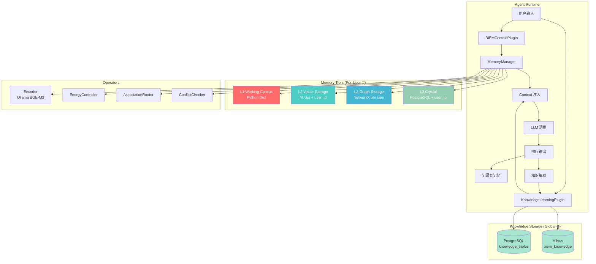

---

## 三层记忆架构

### 层级概念对比

| 层级 | 名称 | 类比 | 存储介质 | 特点 |
|------|------|------|----------|------|
| **L1** | Working Canvas | 工作记忆 | Python Dict | 高速、易失、容量小 |
| **L2** | Association Web | 长期记忆 | Milvus + NetworkX | 向量检索 + 图关联 |
| **L3** | The Crystal | 结晶知识 | PostgreSQL | 持久化事实与链接 |

### L1 - Working Canvas（工作画布）

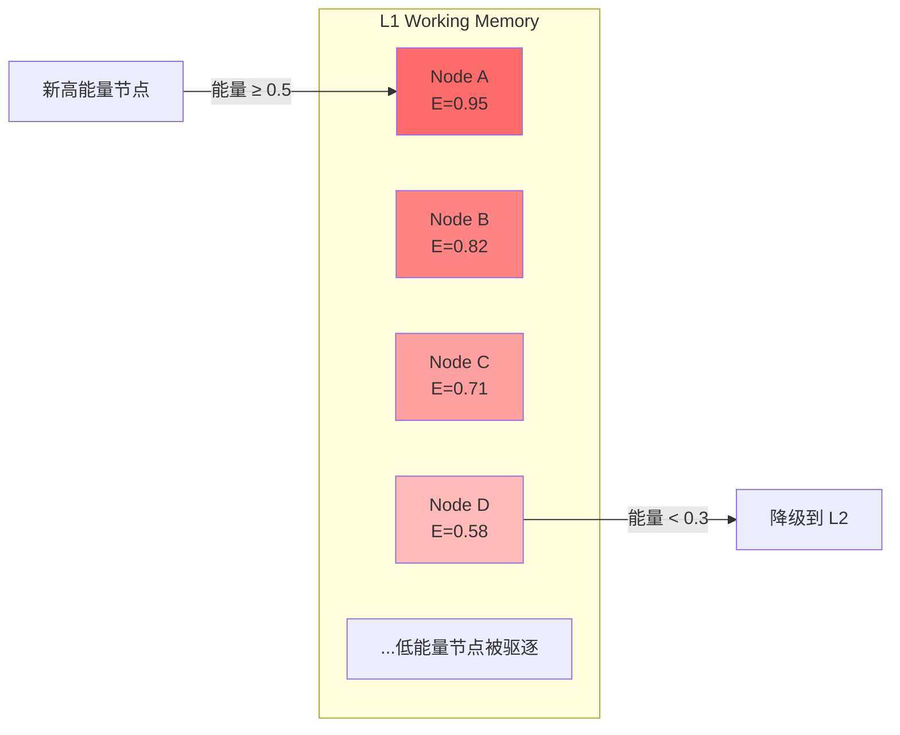

**职责**：
- 存储当前任务最相关的高能量节点
- 容量限制（默认 100 节点），超限时驱逐低能量节点
- 提供最快的访问速度

**配置参数**：
```python
@dataclass
class L1Config:
  max_nodes: int = 100       # 最大容量
  ttl_seconds: float = 3600  # 非活跃超时 (1小时)
  min_energy: float = 0.1    # 最低能量阈值
```

### L2 - Association Web（关联网络）

L2 由两个子系统组成：

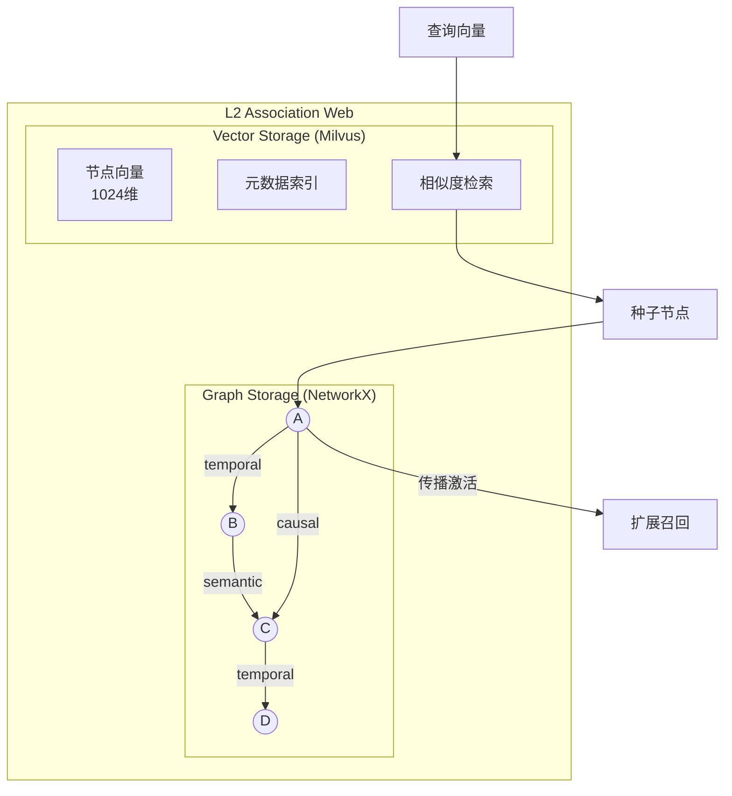

#### L2-Vector (Milvus)

**职责**：
- 存储所有记忆节点的向量嵌入
- 支持高效的语义相似度检索
- 标量字段过滤（能量、时间戳、情感等）

**数据模式**：
```sql
-- Milvus Collection Schema (biem_memories)
id VARCHAR(64) PRIMARY KEY        -- UUID
user_id VARCHAR(64)              -- 用户 ID (隔离键)
content VARCHAR(65535)           -- 原文内容
vector FLOAT_VECTOR(1024)        -- BGE-M3 嵌入
energy FLOAT                     -- 能量值 [0,1]
timestamp INT64                  -- 创建时间戳
last_accessed INT64              -- 最后访问时间
tier VARCHAR(8)                  -- 当前层级
sentiment FLOAT                  -- 情感极性 [-1,1]
```

**查询过滤**：所有向量检索都包含 `user_id == "{current_user}"` 过滤条件

#### L2-Graph (NetworkX)

**职责**：
- 维护节点间的关联关系
- 支持传播激活（Spreading Activation）召回
- 三种链接类型：temporal、semantic、causal

**链接类型**：
```python
class LinkType(Enum):
  TEMPORAL = "temporal"  # 时序关系（同一对话/时间窗口）
  SEMANTIC = "semantic"  # 语义相似（向量相似度 > 0.7）
  CAUSAL = "causal"      # 因果关系（反馈学习建立）
```

### L3 - The Crystal（结晶层）

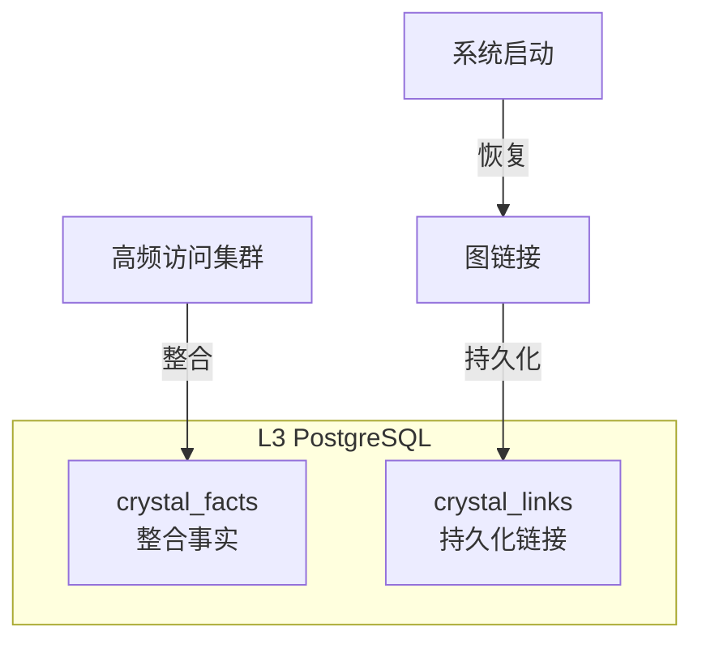

**职责**：
- 持久化存储整合后的事实（CrystalFact）
- 持久化图链接，支持重启恢复
- 长期知识沉淀

**数据表结构**：
```sql
CREATE TABLE crystal_facts (
  id UUID PRIMARY KEY,
  user_id VARCHAR(64) DEFAULT '',   -- 用户隔离
  content TEXT NOT NULL,
  source_node_ids UUID[] DEFAULT '{}',
  confidence FLOAT DEFAULT 1.0,
  created_at TIMESTAMPTZ DEFAULT NOW(),
  updated_at TIMESTAMPTZ DEFAULT NOW(),
  metadata JSONB DEFAULT '{}'
);

CREATE INDEX idx_facts_user ON crystal_facts(user_id);

CREATE TABLE crystal_links (
  id UUID PRIMARY KEY,
  user_id VARCHAR(64) DEFAULT '',   -- 用户隔离
  source_id UUID NOT NULL,
  target_id UUID NOT NULL,
  link_type VARCHAR(16) NOT NULL,
  weight FLOAT DEFAULT 1.0,
  created_at TIMESTAMPTZ DEFAULT NOW(),
  UNIQUE(source_id, target_id, link_type)
);

CREATE INDEX idx_links_user ON crystal_links(user_id);
```

---

## 核心数据结构

### MemoryNode（记忆节点）

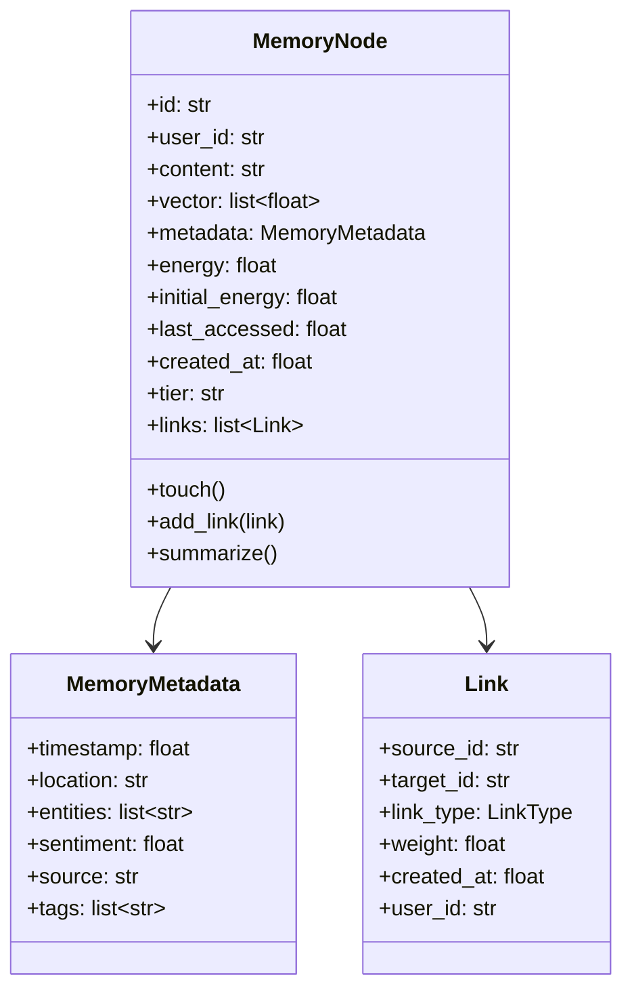

**用户隔离**：
- `user_id` 字段用于区分不同用户的记忆
- 所有存储层（L1/L2/L3）都按 `user_id` 过滤
- 切换用户后，只能访问该用户的记忆数据

### 能量公式

记忆能量随时间指数衰减：

$$E(t) = E_0 \cdot e^{-\lambda \Delta t}$$

其中：
- $E_0$ = 初始能量
- $\lambda$ = 衰减系数（默认 0.1）
- $\Delta t$ = 自上次访问的时间（小时）

---

## 运行时 I/O 交互

### 写入流程（Ingest）

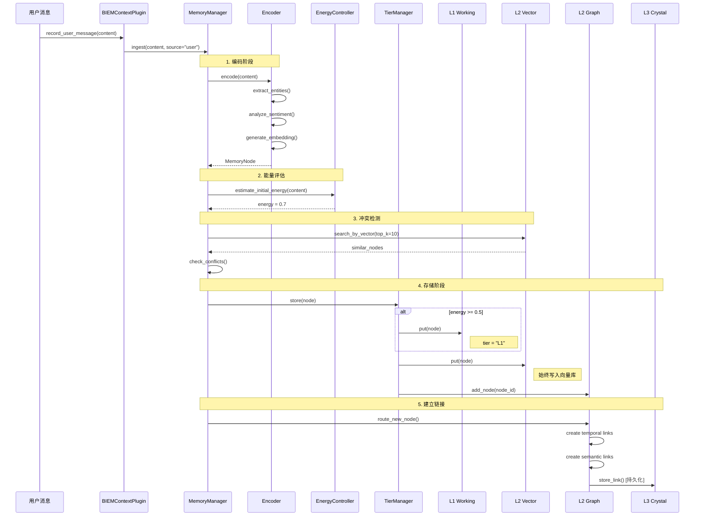

### 触发条件总结

| 操作 | 触发条件 | 目标存储 |
|------|----------|----------|
| 写入 L1 | `energy >= 0.5` | Python Dict |
| 写入 L2 Vector | **始终** | Milvus |
| 添加图节点 | **始终** | NetworkX |
| 建立 Temporal Link | 与最近 5 个节点时间差 < 5分钟 | NetworkX → PostgreSQL |
| 建立 Semantic Link | 向量相似度 > 0.7 | NetworkX → PostgreSQL |
| 写入 L3 Fact | 集群整合（≥5 节点） | PostgreSQL |

### 读取流程（Recall）

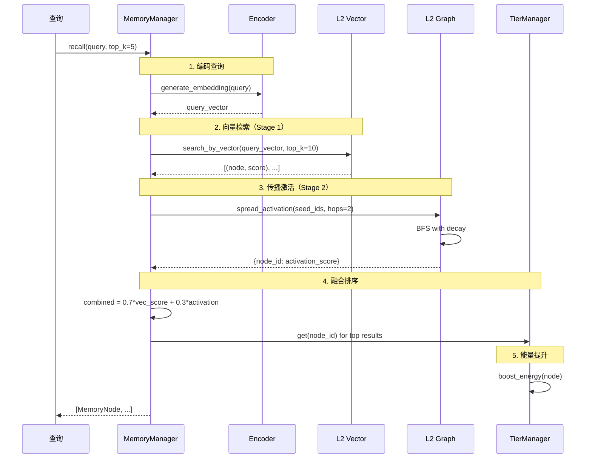

### 层级流动

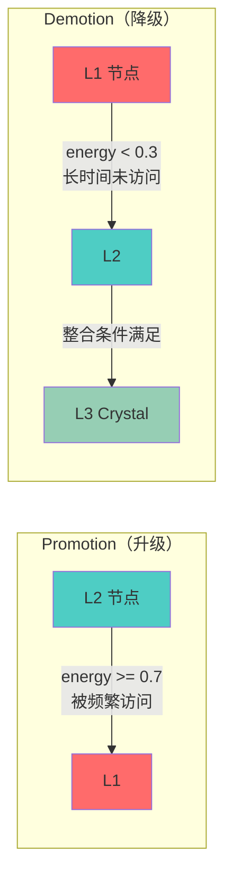

---

## 与 Agent Context 的集成

### 设计原则

记忆系统采用**动态注入**的方式与 Agent 集成，而非静态模板占位符：

1. **解耦设计**：记忆系统作为可选插件，不修改核心 prompt 模板
2. **位置固定**：通过 `ContextManager.build_messages()` 保证 sections 顺序一致
3. **按需注入**：只有召回到相关记忆时才注入，避免空白占位

### 集成数据流

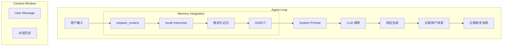

### 集成代码流程

```python
# main.py 中的集成逻辑
async def run_interactive(agent, loop, memory, knowledge):
  while True:
    user_input = get_user_input()
    context_parts = []
    # 1. 召回相关记忆
    if memory:
      memory_context = await memory.prepare_context(user_input)
      if memory_context:
        context_parts.append(memory_context)
    # 2. 召回相关知识
    if knowledge and knowledge.is_available():
      knowledge_context = await knowledge.get_context_for_query(user_input)
      if knowledge_context:
        context_parts.append(knowledge_context)
    # 3. 注入到 Context
    if context_parts:
      agent.context.set_memory_context("\n\n".join(context_parts))
    # 4. LLM 调用
    response = await loop.run_stream(user_input)
    # 5. 清除记忆上下文
    agent.context.clear_memory_context()
    # 6. 记录本轮对话
    if memory:
      await memory.record_user_message(user_input)
      await memory.record_assistant_message(response)
    # 7. 知识抽取
    if knowledge:
      result = await knowledge.process_message(user_input)
      if result.has_pending_confirmation():
        # 显示确认提示
        for prompt in result.confirmation_prompts:
          print(prompt)
```

### Context 构建过程

Agent 的 context 通过 `ContextManager.build_messages()` 方法逐步构建：

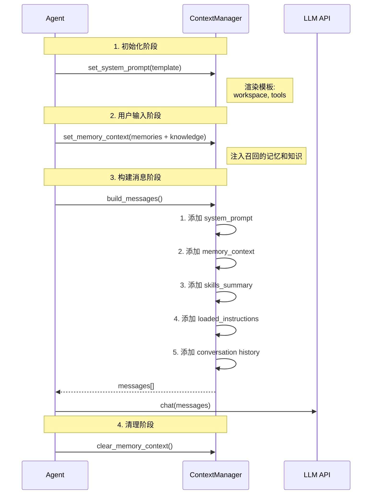

### build_messages() 实现逻辑

```python
def build_messages(self) -> list[dict]:
  """Section order (fixed for agent stability):
  1. System prompt (core instructions, workspace, tools)
  2. Memory context (relevant memories + knowledge)
  3. Skills summary (available skills list)
  4. Loaded skill instructions
  """
  system_content = self._system_prompt
  if self._memory_context:
    system_content += f"\n\n{self._memory_context}"
  skill_summary = self.get_skill_summary()
  if skill_summary:
    system_content += f"\n\n{skill_summary}"
  skill_instructions = self.get_loaded_skill_instructions()
  if skill_instructions:
    system_content += f"\n\n{skill_instructions}"
  messages = [{"role": "system", "content": system_content}]
  for msg in self._messages:
    messages.append(msg.to_openai_format())
  return messages
```

### 最终 Context 结构

```
┌────────────────────────────────────────┐
│ 1. System Prompt (静态)               │
│ - Core Behavior Loop                   │
│ - Skill Loading Protocol               │
│ - Guidelines                           │
│ - Workspace & Tools                    │
├────────────────────────────────────────┤
│ 2. Memory Context (动态注入)           │
│ ## Relevant Memories                   │
│ 1. [● E=0.85] ...                      │
│ ## Learned Knowledge                   │
│ - (GPT-4, context_window, 128k)        │
├────────────────────────────────────────┤
│ 3. Skills Summary (动态)              │
│ - [○] book-flight                     │
│ - [✓] codebase-tools                  │
├────────────────────────────────────────┤
│ 4. Loaded Skill Instructions (动态)   │
│ ### Skill: codebase-tools              │
└────────────────────────────────────────┘
↑ System Message 结束
─────────────────────────────────────────
↓ Conversation Messages 开始
┌────────────────────────────────────────┐
│ 5. Conversation History                │
│ [User]: 之前我们聊了什么？              │
│ [Assistant]: ...                       │
├────────────────────────────────────────┤
│ 6. Current User Message                │
│ [User]: 给我讲讲 PyTorch 的基础知识     │
└────────────────────────────────────────┘
```

---

## 召回策略

### 两阶段召回算法

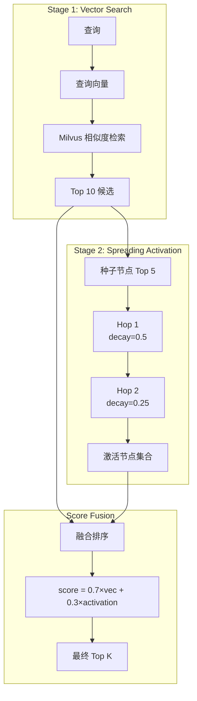

### 召回配置参数

```python
@dataclass
class MemoryConfig:
  default_recall_limit: int = 10          # 默认返回数量
  spreading_activation_hops: int = 2       # 传播跳数
  spreading_decay_factor: float = 0.5     # 每跳衰减系数
```

### 召回内容格式

```markdown
## Relevant Memories
1. [● E=0.85] 用户之前提到正在学习机器学习，特别对深度学习感兴趣...
Entities: 机器学习, 深度学习, PyTorch
2. [○ E=0.62] 深度学习是机器学习的一个分支，使用多层神经网络...
Entities: 深度学习, 神经网络, 反向传播
3. [◌ E=0.41] PyTorch 是一个常用的深度学习框架...
Entities: PyTorch, TensorFlow, 框架
```

**能量指示器**：
- `●` = 高能量 (energy > 0.7)
- `○` = 中能量 (0.3 < energy ≤ 0.7)
- `◌` = 低能量 (energy ≤ 0.3)

---

## 能量衰减机制

### 衰减与增强

```mermaid
graph LR
subgraph "Energy Dynamics"
  DECAY[时间衰减<br/>E = E₀ × e^(-λΔt)]
  BOOST[访问增强<br/>E += 0.1]
  FEEDBACK[反馈调节<br/>E += feedback × 0.1]
end
TIME[时间流逝] --> DECAY
ACCESS[被召回/访问] --> BOOST
USER[用户反馈] --> FEEDBACK
```

### 能量阈值与行为

| 能量范围 | 状态 | 系统行为 |
|----------|------|----------|
| `≥ 0.7` | 热记忆 | 可升级到 L1 |
| `0.5 ~ 0.7` | 温记忆 | 保持在 L1 或 L2 |
| `0.3 ~ 0.5` | 冷记忆 | 可能从 L1 降级 |
| `< 0.3` | 遗忘边缘 | 从 L1 驱逐到 L2 |
| `< 0.1` | 濒临遗忘 | 可能被清理 |

---

## 知识学习系统 (Knowledge Learning)

BIEM 记忆系统的扩展模块，从对话中抽取结构化知识三元组，支持知识更新和冲突检测。

### 核心设计原则

| 特性 | 说明 |
|------|------|
| **🌐 全局共享** | 知识库在所有用户之间共享，形成集体知识图谱 |
| **🚫 严格过滤** | 只抽取客观事实，拒绝用户个人信息 |
| **🔗 簇扩散召回** | 语义检索后扩散到相关知识簇 |
| **🤖 Agent 贡献** | Agent 也可从自己的回复中提取知识 |

### 知识抽取原则

**✅ 应该抽取的知识**：
- 客观事实：`(Python, created_by, Guido van Rossum)`
- 技术概念：`(Machine Learning, is_subset_of, Artificial Intelligence)`
- 流程描述：`(Gradient Descent, used_for, Neural Network Training)`

**❌ 不应该抽取的知识**：
- 用户个人信息：~~`(user, age, 25)`~~
- 用户偏好：~~`(user, prefers, dark_mode)`~~
- 用户位置：~~`(user, lives_in, Beijing)`~~
- 主观观点：~~`(user, thinks, Python is better)`~~

### 系统架构

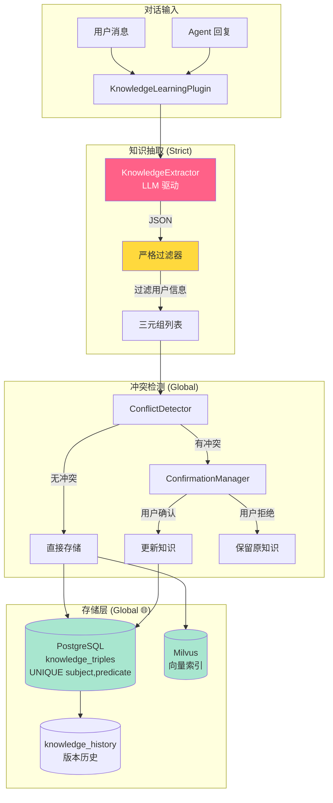

### 知识三元组 (KnowledgeTriple)

知识以 `(Subject, Predicate, Object)` 三元组形式存储：

```python
@dataclass
class KnowledgeTriple:
  id: str                     # UUID
  subject: str                # 主体: "GPT-4", "Python" (不允许 "user")
  predicate: str              # 关系: "context_window", "created_by"
  object: str                 # 客体: "128k tokens", "Guido"
  confidence: float = 0.8     # 置信度 0.0~1.0
  source: KnowledgeSource     # 来源类型
  version: int = 1            # 版本号 (更新时递增)
  previous_values: list[str]  # 历史值
  session_id: str             # 创建 Session
  user_id: str                # 贡献者 ID (归因，非隔离)
  created_at: float           # 创建时间戳
  updated_at: float           # 更新时间戳
  vector: list[float]         # 向量嵌入 (语义检索)
```

**全局唯一约束**：`UNIQUE(subject, predicate)` — 同一主体的同一关系只有一个值

| Subject | Predicate | Object |
|---------|-----------|--------|
| GPT-4 | context_window | 128k tokens |
| Python | created_by | Guido van Rossum |
| Claude 3.5 | max_output | 8k tokens |

**禁止的 Subject**：
- `user` — 不允许以用户为主体的三元组
- 任何个人信息相关的主体

### 知识意图 (KnowledgeIntent)

```python
class KnowledgeIntent(str, Enum):
  STATEMENT = "statement"     # 正常事实陈述
  CORRECTION = "correction"   # 纠正之前的信息
  QUESTION = "question"       # 询问某知识
  OPINION = "opinion"         # 主观观点 (不存储)
```

### 知识来源 (KnowledgeSource)

```python
class KnowledgeSource(str, Enum):
  CONVERSATION = "conversation"       # 对话中提取
  USER_STATED = "user_stated"         # 用户明确陈述
  USER_CORRECTION = "user_correction" # 用户纠正
  USER_VERIFIED = "user_verified"     # 用户确认更新
  AGENT_INFERRED = "agent_inferred"   # Agent 从回复/搜索结果中推断
```

**Agent 知识贡献**：Agent 在回答问题时（如通过网络搜索获取信息），也会从自己的回复中抽取知识并存入全局知识库。

### 抽取结果 (ExtractionResult)

```python
@dataclass
class ExtractionResult:
  is_factual: bool = False        # 是否包含事实内容
  intent: KnowledgeIntent         # 用户意图
  triples: list[KnowledgeTriple]  # 抽取的三元组
  confidence: float = 0.0         # 抽取置信度
  raw_message: str = ""           # 原始消息
```

### 冲突结果 (ConflictResult)

```python
@dataclass
class ConflictResult:
  has_conflict: bool = False
  existing_triple: KnowledgeTriple | None = None
  new_triple: KnowledgeTriple | None = None
  conflict_type: str = ""         # "value_change", "contradiction"
  suggestion: str = ""            # 人类可读建议
```

### 待确认更新 (PendingUpdate)

```python
@dataclass
class PendingUpdate:
  id: str
  new_triple: KnowledgeTriple
  existing_triple: KnowledgeTriple | None
  confirmation_message: str
  expires_at: float  # 5分钟超时
```

### 知识抽取流程

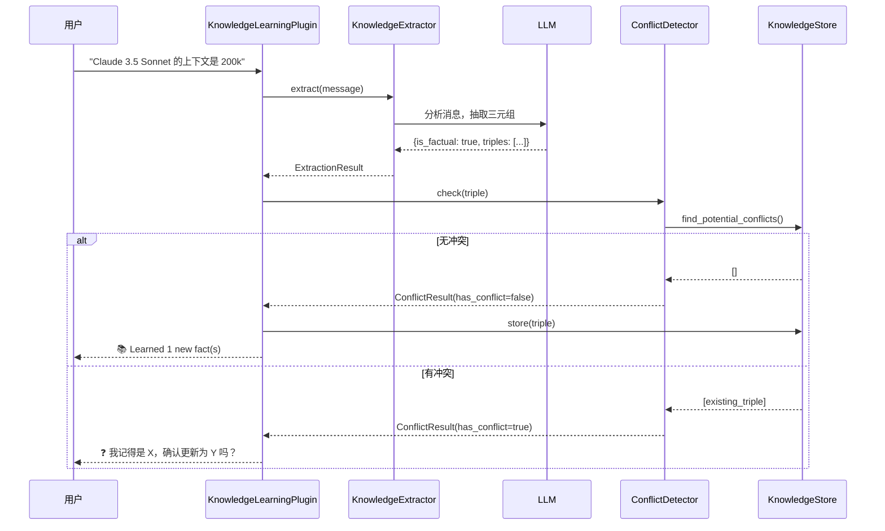

### 冲突确认流程

当检测到新知识与已有知识冲突时：

```
Session 1:
─────────────────────────────────────────
用户: GPT-4 的上下文窗口是 32k
Agent: 📚 Learned 1 new fact(s)
[存储: (GPT-4, context_window, 32k)]

Session 2:
─────────────────────────────────────────
用户: 其实 GPT-4 现在支持 128k 了
Agent: ❓ 我记得 GPT-4 的 context window 是 32k tokens，
      您确认更新为 128k 了吗？
用户: 是的
Agent: 好的，知识已更新！
[更新: (GPT-4, context_window, 128k), version=2]
```

### 跨 Session 知识召回

知识在新 Session 中自动注入相关上下文：

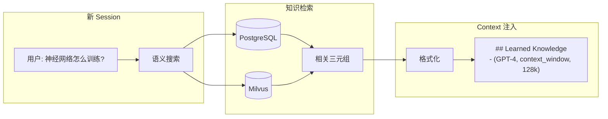

### 簇扩散召回 (Cluster Expansion)

知识检索支持"簇扩散"机制，在初始语义匹配后，扩展到相关知识簇：

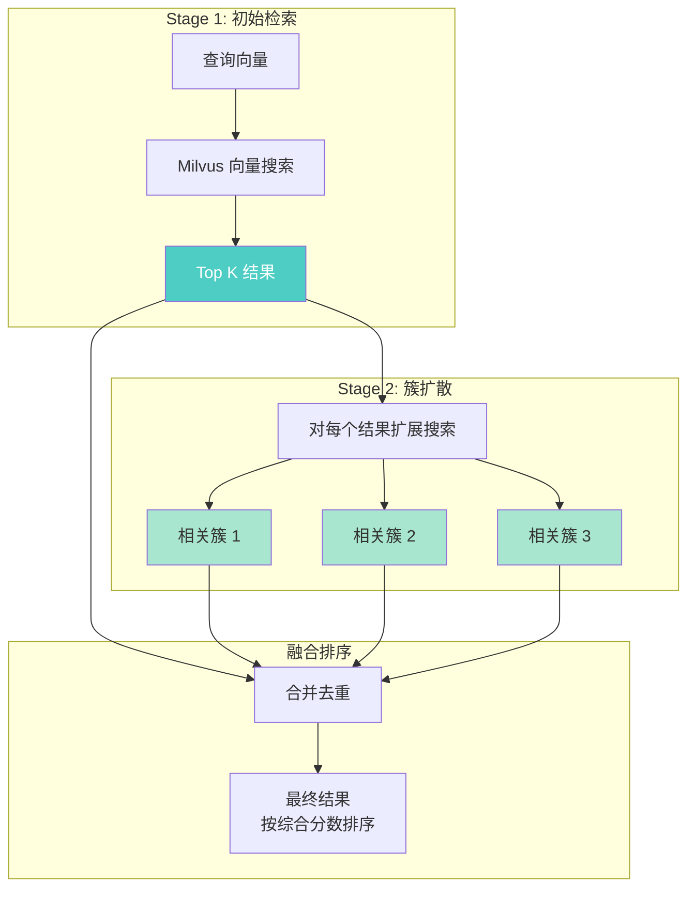

**扩散算法**：
```python
async def search_with_cluster_expansion(
    query: str,
    top_k: int = 5,           # 初始检索数量
    expansion_k: int = 3,      # 每个结果扩展数量
    min_score: float = 0.5,    # 初始结果最低分数
    expansion_min_score: float = 0.4  # 扩展结果最低分数
) -> list[tuple[str, float]]:
    # 1. 初始向量检索
    initial_results = vector_search(query, top_k)
    
    # 2. 对每个初始结果进行扩展搜索
    for result in initial_results:
        cluster_results = vector_search(result.vector, expansion_k)
        # 扩展结果权重降低 (× 0.7)
        merge_with_lower_weight(cluster_results)
    
    # 3. 去重并按综合分数排序
    return deduplicate_and_sort()
```

**效果**：查询"神经网络"时，不仅返回直接相关的知识，还会扩散到"反向传播"、"梯度下降"、"激活函数"等相关知识簇。

### 数据库 Schema

```sql
-- 知识三元组表 (全局共享)
CREATE TABLE knowledge_triples (
  id UUID PRIMARY KEY,
  subject VARCHAR(255) NOT NULL,
  predicate VARCHAR(255) NOT NULL,
  object TEXT NOT NULL,
  confidence FLOAT DEFAULT 0.8,
  source VARCHAR(32) DEFAULT 'conversation',
  version INT DEFAULT 1,
  previous_values JSONB DEFAULT '[]',
  user_id VARCHAR(64) DEFAULT '',     -- 贡献者 ID (归因，非隔离)
  session_id VARCHAR(64) DEFAULT '',
  created_at TIMESTAMPTZ DEFAULT NOW(),
  updated_at TIMESTAMPTZ DEFAULT NOW(),
  
  -- 全局唯一约束 (不按用户隔离)
  UNIQUE(subject, predicate)
);

CREATE INDEX idx_triples_subject ON knowledge_triples(subject);
CREATE INDEX idx_triples_predicate ON knowledge_triples(predicate);

-- 知识更新历史表
CREATE TABLE knowledge_history (
  id UUID PRIMARY KEY,
  triple_id UUID REFERENCES knowledge_triples(id) ON DELETE CASCADE,
  old_value TEXT,
  new_value TEXT,
  reason VARCHAR(64),
  confirmed BOOLEAN DEFAULT false,
  session_id VARCHAR(64) DEFAULT '',
  contributor_id VARCHAR(64) DEFAULT '',  -- 贡献者
  timestamp TIMESTAMPTZ DEFAULT NOW()
);
```

**关键设计**：
- `UNIQUE(subject, predicate)` 而非 `UNIQUE(user_id, subject, predicate)`
- 知识是全局的，任何用户都可以更新同一个三元组
- `user_id` 仅用于追踪谁贡献了这条知识

### 与 Memory Context 的融合

知识上下文与记忆上下文合并注入：

```python
# main.py 集成逻辑
context_parts = []

# 记忆上下文 (Per-User)
if memory:
  memory_context = await memory.prepare_context(user_input)
  if memory_context:
    context_parts.append(memory_context)

# 知识上下文 (Global, 使用簇扩散)
if knowledge and knowledge.is_available():
  knowledge_context = await knowledge.get_context_for_query(user_input)
  if knowledge_context:
    context_parts.append(knowledge_context)

agent.context.set_memory_context("\n\n".join(context_parts))

# Agent 回复后，也从回复中抽取知识
if knowledge:
  await knowledge.process_message(user_input, role="user")
  await knowledge.process_message(response, role="assistant")
```

**最终注入格式**：

```markdown
## Relevant Memories (👤 Per-User)
1. [● E=0.85] 用户正在学习机器学习...
Entities: 机器学习, PyTorch

## Learned Knowledge (🌐 Global)
- (GPT-4, context_window, 128k tokens) [user_verified]
- (Claude 3.5, max_output, 8k tokens) [user_stated]
- (Gradient Descent, used_for, Neural Network Training) [agent_inferred]
```

### 配置参数

```python
@dataclass
class KnowledgePluginConfig:
  store_config: KnowledgeStoreConfig    # PostgreSQL 配置
  vector_config: KnowledgeVectorConfig  # Milvus 配置
  extractor_config: ExtractorConfig     # LLM 抽取配置
  conflict_config: ConflictConfig       # 冲突检测配置
  auto_store: bool = True               # 自动存储无冲突知识
  extract_from_agent: bool = True       # 从 Agent 消息抽取知识
  max_context_items: int = 10           # Context 中最大知识条数
  enable_vector_search: bool = True     # 启用向量语义搜索
  enable_cluster_expansion: bool = True # 启用簇扩散召回
  user_id: str = ""                     # 贡献者 ID (归因，非隔离)
  session_id: str = ""                  # Session ID
```

### 严格抽取过滤器

```python
# 禁止的谓词列表 (用户个人信息)
USER_SPECIFIC_PREDICATES = frozenset({
    "name", "age", "birthday", "birth_date",
    "location", "address", "city", "country",
    "email", "phone", "phone_number",
    "job", "workplace", "employer", "occupation",
    "preference", "ui_preference", "editor",
    "favorite", "likes", "dislikes",
    "hobby", "hobbies", "interest", "interests",
    "goal", "goals", "project", "current_project", "working_on",
})

# 过滤逻辑
def filter_triple(triple: KnowledgeTriple) -> bool:
    # 拒绝 subject == "user"
    if triple.subject.lower() == "user":
        return False
    # 拒绝用户相关谓词
    if triple.predicate.lower() in USER_SPECIFIC_PREDICATES:
        return False
    return True
```

---

## 附录：配置参考

### 环境变量

```bash
# Milvus 配置
MILVUS_HOST=localhost
MILVUS_PORT=19530
MILVUS_COLLECTION=biem_memories      # 记忆向量集合 (per-user)
MILVUS_USE_LITE=false
# 知识向量集合名默认为 biem_knowledge (global)

# PostgreSQL 配置
POSTGRES_HOST=localhost
POSTGRES_PORT=5432
POSTGRES_DB=biem
POSTGRES_USER=your_user
POSTGRES_PASSWORD=

# 记忆系统开关
DISABLE_MEMORY=false

# 知识学习开关
DISABLE_KNOWLEDGE=false
KNOWLEDGE_VECTOR_SEARCH=true
KNOWLEDGE_CLUSTER_EXPANSION=true    # 启用簇扩散

# 用户配置
USER_ID=default                     # 初始用户 ID (记忆隔离用)
```

### 启动服务

```bash
# 启动 Milvus (Docker)
docker compose -f docker-compose.milvus.yml up -d
# 启动 PostgreSQL (如果使用本地)
brew services start postgresql@18
# 创建数据库
psql -U your_user -c "CREATE DATABASE biem;"
# 运行 Agent
uv run python main.py
```

### 可视化界面

```bash
# 启动 Web 可视化 (Monokai Pro 主题)
uv run uvicorn src.omniemployee.web.app:app --port 8000
# 访问 http://localhost:8000
```

功能包括：

**记忆面板 (Per-User 👤)**：
- **L1 Working Memory 👤**: 当前用户的工作记忆节点列表
- **L2 Vector Storage 👤**: 当前用户的向量存储统计和节点预览
- **L2 Graph 👤**: D3.js 力导向图可视化当前用户的节点关联
- **L3 Facts/Links 👤**: 当前用户的 PostgreSQL 持久化数据

**知识面板 (Global 🌐)**：
- **Knowledge 🌐**: 全局共享的知识三元组列表

**用户管理**：
- 顶部下拉框切换用户
- 创建新用户按钮
- 切换用户后，记忆数据自动切换，知识数据保持不变

### GUI 客户端

```bash
# 启动 GPUI 原生客户端
cd gui && cargo run --release
```

功能包括：
- 实时流式对话
- 用户切换（头部下拉选择器）
- 侧边栏显示 Memory 👤 和 Knowledge 🌐
- 工具调用实时展示

### 数据库重置脚本

当需要清空数据或更新 Schema 时：

```bash
# 重置 Milvus 和 PostgreSQL
uv run python scripts/reset_databases.py
```

该脚本会：
1. 删除并重建 Milvus collections：
   - `biem_memories` (记忆向量，含 `user_id`)
   - `biem_knowledge` (知识向量，全局)
2. 删除并重建 PostgreSQL 表：
   - `crystal_facts` (L3 事实，含 `user_id`)
   - `crystal_links` (L3 链接，含 `user_id`)
   - `knowledge_triples` (知识三元组，全局唯一)
   - `knowledge_history` (更新历史)
