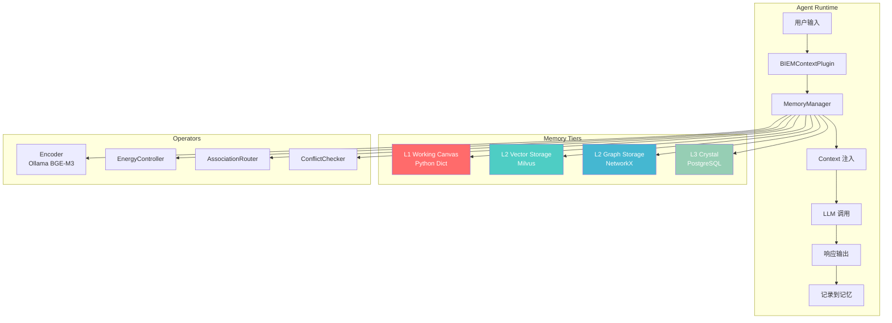
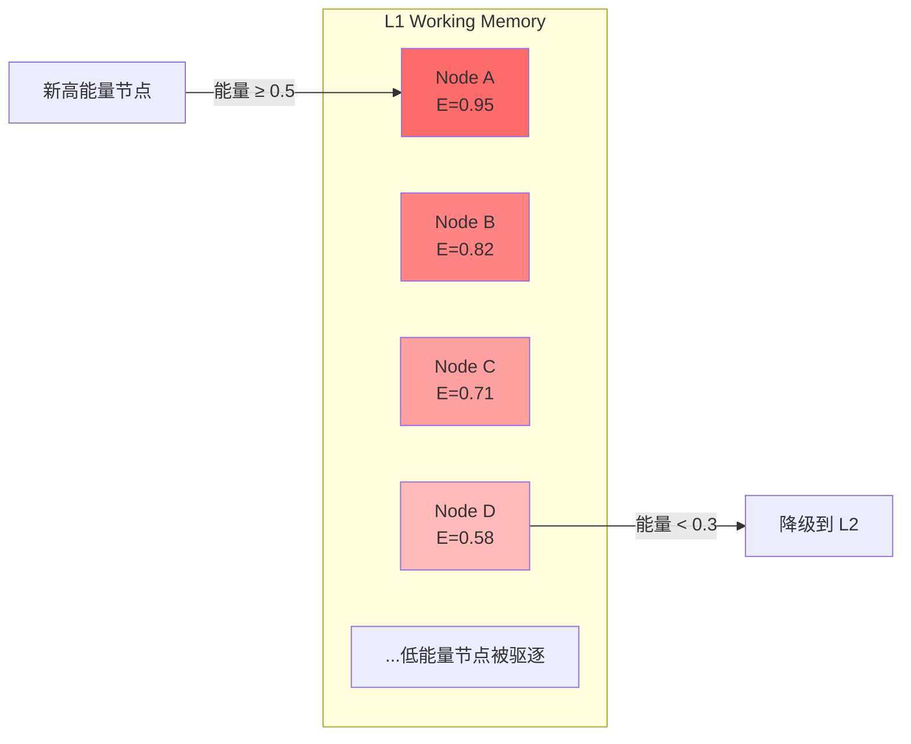
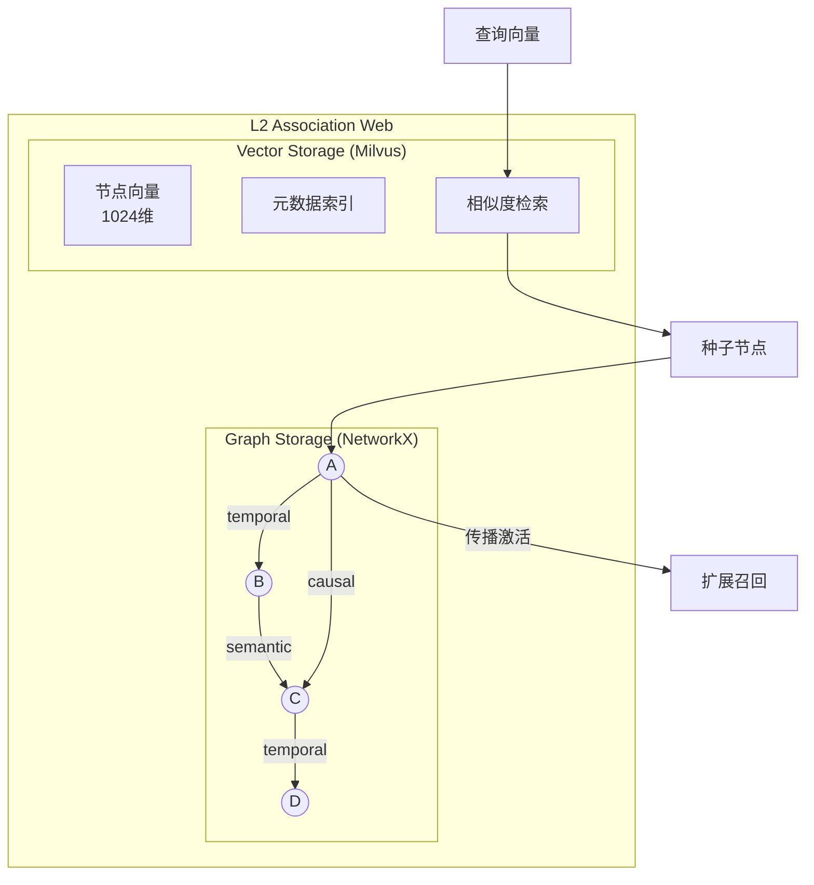
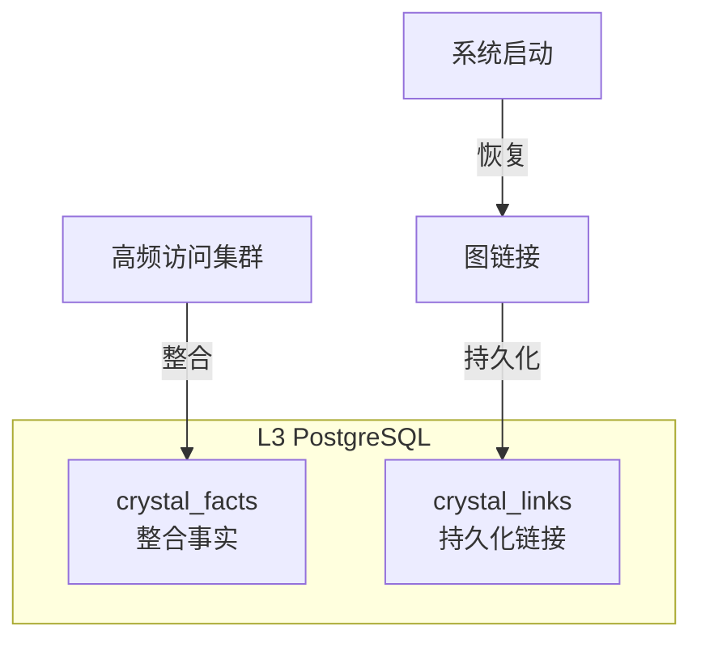
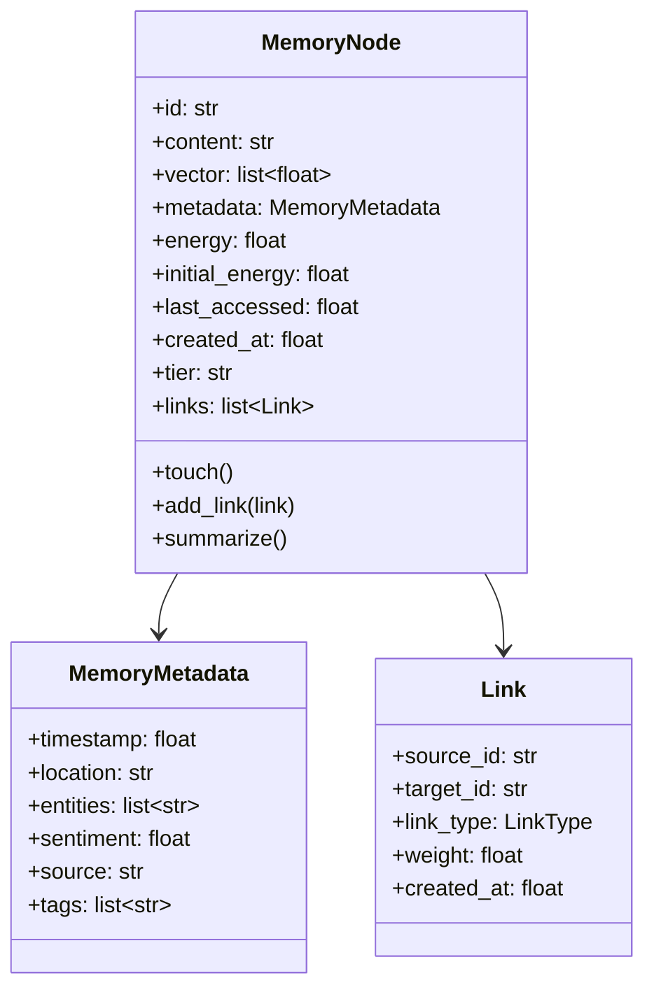
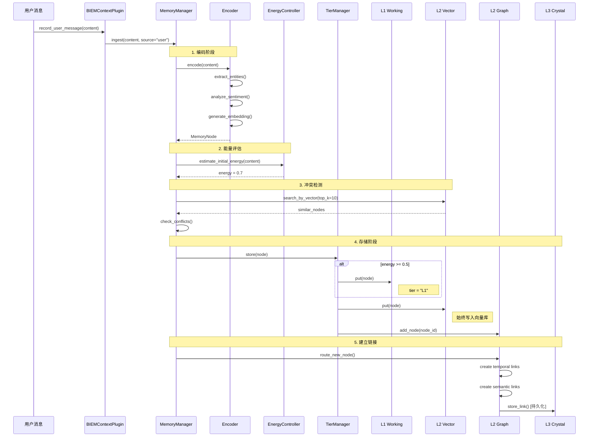
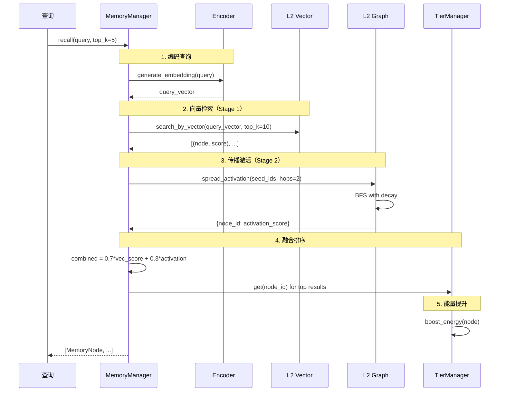
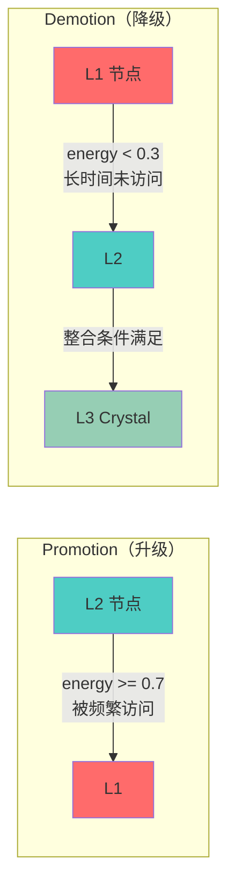
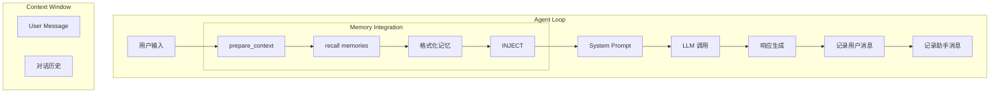
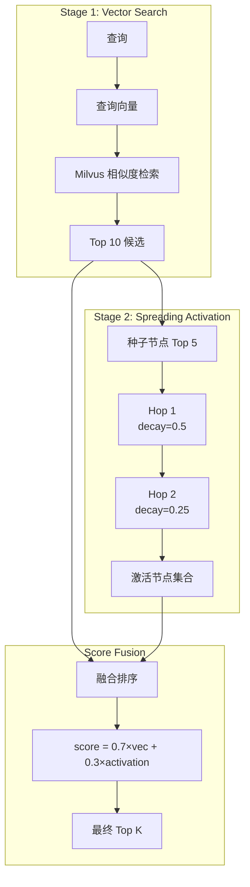

# BIEM 记忆系统技术文档

> **Bio-Inspired Evolving Memory (BIEM)** — 一个仿生学启发的多层级记忆系统

## 目录

1. [系统概述](#系统概述)
2. [三层记忆架构](#三层记忆架构)
3. [核心数据结构](#核心数据结构)
4. [运行时 I/O 交互](#运行时-io-交互)
5. [与 Agent Context 的集成](#与-agent-context-的集成)
6. [召回策略](#召回策略)
7. [能量衰减机制](#能量衰减机制)

---

## 系统概述

BIEM 是一个模拟人类记忆机制的多层级记忆系统，具有以下核心特性：

- **能量衰减**：记忆随时间自然遗忘，频繁访问的记忆保持活跃
- **关联激活**：通过图结构实现记忆间的联想传播
- **冲突检测**：识别新旧信息之间的认知失调
- **层级流动**：记忆在不同层级间根据"热度"自动升降

### 系统架构总览



---

## 三层记忆架构

### 层级概念对比

| 层级 | 名称 | 类比 | 存储介质 | 特点 |
|------|------|------|----------|------|
| **L1** | Working Canvas | 工作记忆 | Python Dict | 高速、易失、容量小 |
| **L2** | Association Web | 长期记忆 | Milvus + NetworkX | 向量检索 + 图关联 |
| **L3** | The Crystal | 结晶知识 | PostgreSQL | 持久化事实与链接 |

### L1 - Working Canvas（工作画布）



**职责**：
- 存储当前任务最相关的高能量节点
- 容量限制（默认 100 节点），超限时驱逐低能量节点
- 提供最快的访问速度

**配置参数**：
```python
@dataclass
class L1Config:
    max_nodes: int = 100        # 最大容量
    ttl_seconds: float = 3600   # 非活跃超时时间 (1小时)
    min_energy: float = 0.1     # 最低能量阈值
```

### L2 - Association Web（关联网络）

L2 由两个子系统组成：



#### L2-Vector (Milvus)

**职责**：
- 存储所有记忆节点的向量嵌入
- 支持高效的语义相似度检索
- 标量字段过滤（能量、时间戳、情感等）

**数据模式**：
```sql
-- Milvus Collection Schema
id          VARCHAR(64) PRIMARY KEY  -- UUID
content     VARCHAR(65535)           -- 原文内容
vector      FLOAT_VECTOR(1024)       -- BGE-M3 嵌入
energy      FLOAT                    -- 能量值 [0,1]
timestamp   INT64                    -- 创建时间戳
last_accessed INT64                  -- 最后访问时间
tier        VARCHAR(8)               -- 当前层级
sentiment   FLOAT                    -- 情感极性 [-1,1]
```

#### L2-Graph (NetworkX)

**职责**：
- 维护节点间的关联关系
- 支持传播激活（Spreading Activation）召回
- 三种链接类型：temporal、semantic、causal

**链接类型**：
```python
class LinkType(Enum):
    TEMPORAL = "temporal"   # 时序关系（同一对话/时间窗口）
    SEMANTIC = "semantic"   # 语义相似（向量相似度 > 0.7）
    CAUSAL = "causal"       # 因果关系（反馈学习建立）
```

### L3 - The Crystal（结晶层）



**职责**：
- 持久化存储整合后的事实（CrystalFact）
- 持久化图链接，支持重启恢复
- 长期知识沉淀

**数据表结构**：
```sql
-- crystal_facts 表
CREATE TABLE crystal_facts (
    id UUID PRIMARY KEY,
    content TEXT NOT NULL,
    source_node_ids TEXT[],          -- 来源节点 ID
    confidence FLOAT DEFAULT 1.0,
    created_at TIMESTAMP,
    updated_at TIMESTAMP,
    metadata JSONB
);

-- crystal_links 表
CREATE TABLE crystal_links (
    id SERIAL PRIMARY KEY,
    source_id VARCHAR(64),
    target_id VARCHAR(64),
    link_type VARCHAR(16),           -- temporal/semantic/causal
    weight FLOAT DEFAULT 1.0,
    created_at TIMESTAMP,
    UNIQUE(source_id, target_id, link_type)
);
```

---

## 核心数据结构

### MemoryNode（记忆节点）



### 能量公式

记忆能量随时间指数衰减：

$$E(t) = E_0 \cdot e^{-\lambda \Delta t}$$

其中：
- $E_0$ = 初始能量
- $\lambda$ = 衰减系数（默认 0.1）
- $\Delta t$ = 自上次访问的时间（小时）

---

## 运行时 I/O 交互

### 写入流程（Ingest）



### 触发条件总结

| 操作 | 触发条件 | 目标存储 |
|------|----------|----------|
| 写入 L1 | `energy >= 0.5` | Python Dict |
| 写入 L2 Vector | **始终** | Milvus |
| 添加图节点 | **始终** | NetworkX |
| 建立 Temporal Link | 与最近 5 个节点时间差 < 5分钟 | NetworkX → PostgreSQL |
| 建立 Semantic Link | 向量相似度 > 0.7 | NetworkX → PostgreSQL |
| 写入 L3 Fact | 集群整合（≥5 节点） | PostgreSQL |

### 读取流程（Recall）



### 层级流动



---

## 与 Agent Context 的集成

### 数据流图



### 集成代码流程

```python
# main.py 中的集成逻辑

async def run_interactive(agent, loop, memory):
    while True:
        user_input = get_user_input()
        
        # 1. 召回相关记忆并注入
        if memory:
            memory_context = await memory.prepare_context(user_input)
            if memory_context:
                # 临时追加到 system prompt
                original_prompt = agent.context._system_prompt
                agent.context.set_system_prompt(
                    original_prompt + "\n\n" + memory_context
                )
        
        # 2. LLM 调用
        response = await loop.run_stream(user_input)
        
        # 3. 恢复原始 system prompt
        if memory:
            agent.context.set_system_prompt(original_prompt)
        
        # 4. 记录本轮对话到记忆
        if memory:
            await memory.record_user_message(user_input)
            await memory.record_assistant_message(response)
```

### Context 位置示意

```
┌─────────────────────────────────────────────────────────┐
│                    System Prompt                         │
│  ┌─────────────────────────────────────────────────┐    │
│  │ You are OmniEmployee, an AI coding assistant... │    │
│  └─────────────────────────────────────────────────┘    │
│                                                         │
│  ┌─────────────────────────────────────────────────┐    │
│  │ ## Relevant Memories   ← 记忆注入位置            │    │
│  │ 1. [● E=0.85] 用户正在学习机器学习...            │    │
│  │    Entities: 机器学习, PyTorch                   │    │
│  │ 2. [○ E=0.62] 深度学习是机器学习的分支...        │    │
│  │    Entities: 深度学习, 神经网络                  │    │
│  └─────────────────────────────────────────────────┘    │
├─────────────────────────────────────────────────────────┤
│                   Conversation History                   │
│  [User]: 之前我们聊了什么？                              │
│  [Assistant]: ...                                        │
├─────────────────────────────────────────────────────────┤
│                   Current User Message                   │
│  [User]: 给我讲讲 PyTorch 的基础知识                     │
└─────────────────────────────────────────────────────────┘
```

---

## 召回策略

### 两阶段召回算法



### 召回配置参数

```python
@dataclass
class MemoryConfig:
    default_recall_limit: int = 10       # 默认返回数量
    spreading_activation_hops: int = 2    # 传播跳数
    spreading_decay_factor: float = 0.5   # 每跳衰减系数
```

### 召回内容格式

```markdown
## Relevant Memories

1. [● E=0.85] 用户之前提到正在学习机器学习，特别对深度学习感兴趣...
   Entities: 机器学习, 深度学习, PyTorch

2. [○ E=0.62] 深度学习是机器学习的一个分支，使用多层神经网络...
   Entities: 深度学习, 神经网络, 反向传播

3. [◌ E=0.41] PyTorch 是一个常用的深度学习框架...
   Entities: PyTorch, TensorFlow, 框架
```

**能量指示器**：
- `●` = 高能量 (energy > 0.7)
- `○` = 中能量 (0.3 < energy ≤ 0.7)
- `◌` = 低能量 (energy ≤ 0.3)

---

## 能量衰减机制

### 衰减与增强

```mermaid
graph LR
    subgraph "Energy Dynamics"
        DECAY[时间衰减<br/>E = E₀ × e^(-λΔt)]
        BOOST[访问增强<br/>E += 0.1]
        FEEDBACK[反馈调节<br/>E += feedback × 0.1]
    end
    
    TIME[时间流逝] --> DECAY
    ACCESS[被召回/访问] --> BOOST
    USER[用户反馈] --> FEEDBACK
```

### 能量阈值与行为

| 能量范围 | 状态 | 系统行为 |
|----------|------|----------|
| `≥ 0.7` | 热记忆 | 可升级到 L1 |
| `0.5 ~ 0.7` | 温记忆 | 保持在 L1 或 L2 |
| `0.3 ~ 0.5` | 冷记忆 | 可能从 L1 降级 |
| `< 0.3` | 遗忘边缘 | 从 L1 驱逐到 L2 |
| `< 0.1` | 濒临遗忘 | 可能被清理 |

---

## 附录：配置参考

### 环境变量

```bash
# Milvus 配置
MILVUS_HOST=localhost
MILVUS_PORT=19530
MILVUS_COLLECTION=biem_memories
MILVUS_USE_LITE=false

# PostgreSQL 配置
POSTGRES_HOST=localhost
POSTGRES_PORT=5432
POSTGRES_DB=biem
POSTGRES_USER=your_user
POSTGRES_PASSWORD=

# 记忆系统开关
DISABLE_MEMORY=false
```

### 启动服务

```bash
# 启动 Milvus (Docker)
docker compose -f docker-compose.milvus.yml up -d

# 启动 PostgreSQL (如果使用本地)
brew services start postgresql@18

# 创建数据库
psql -U your_user -c "CREATE DATABASE biem;"

# 运行 Agent
uv run python main.py
```

### 可视化界面

```bash
# 启动 Web 可视化
uv run uvicorn src.omniemployee.web.app:app --port 8765

# 访问 http://localhost:8765
```
